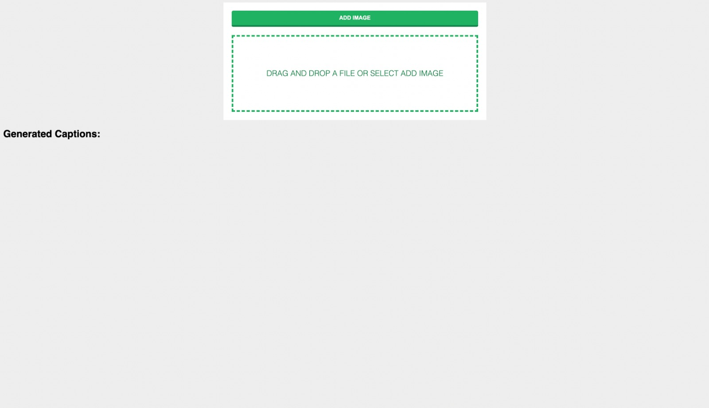
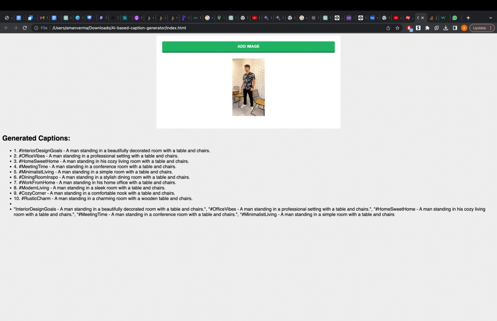
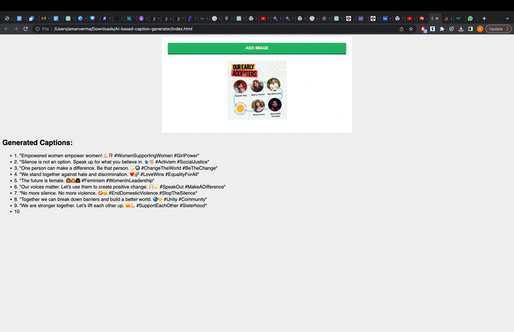
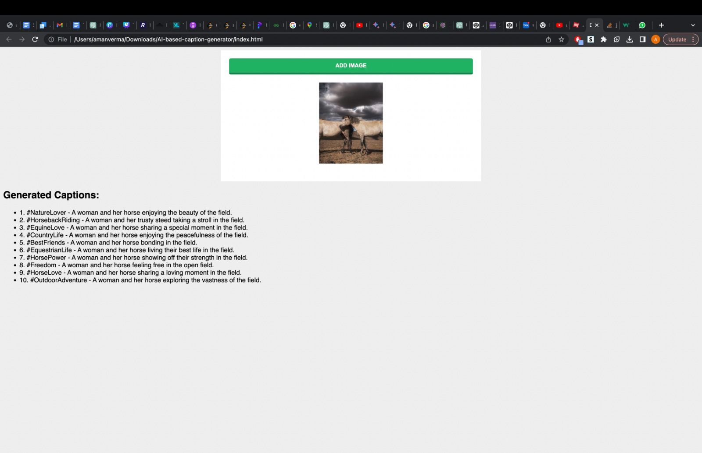
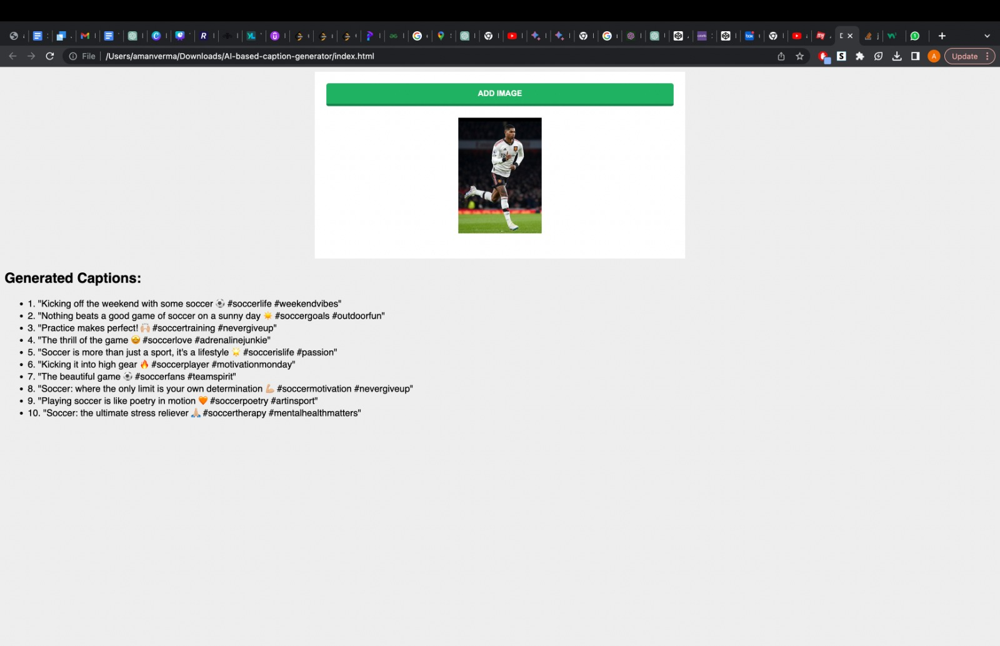

# AI-based-caption-generator
## Downloading the dependencies
```
    pip install -r req.txt
```
## running the app 
In the command line interface for running the service on local server: 
```
    uvicorn main:app --reload
```

Once the service is running open the `index.html` file in a browser. 

## Usage


Upload the image and the response will be in text format just below.







## Idea behind the project
### 1. First step involves the image acquisition from the user side.
### 2. Once we have the image we pass it to the `vit-gpt2-image-captioning` transformer based encoder-decoder model.

## 3. The above model converts the images to its respective latent vector .
## 4. The latent vector is passed to the decoder and respective caption is generated.
## 5. The caption from the vit model is very generic and hence cannot be used on social media directly, hence we pass that caption to chat-gpt api and get respective 10 captions tailored for the social media with proper hashtags. 